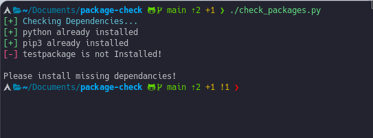

# **Package Checker**

This module can be integrated in your scripts to check if a package is installed before your main code is run.
Can help fix most dependancies issues since you will check all your required packeges before executing main code.

## **Compactibility**

Requires that you are using python 3 and on a GNU/Linux environment.

## **Usage**

You will need to add your packages in the list of packages hardcoded. Replace with your own, its safe to remove the existing ones.